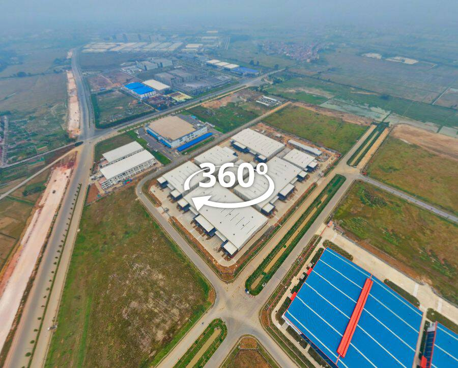

# Virtual Tour KTG Industrial VSIP Bac Ninh II

  
  
  
  
  

Dự án Virtual Tour 360° cho khu công nghiệp KTG Industrial tại VSIP Bắc Ninh II. Tour cung cấp cái nhìn toàn cảnh từ trên cao (Drone View) và chi tiết các khu vực nhà xưởng (Ready-Built Factory).

## 🚀 Công nghệ sử dụng

Dự án được xây dựng dựa trên nền tảng **3DVista Virtual Tour**, bao gồm các công nghệ lõi sau:

### 1. Công cụ chính (Core Engine)
*   **3DVista Player**: Phiên bản 0.2249 (Major: 0, Minor: 2249).
*   **Library (tdvplayer.js)**: Build version 0.2244.

### 2. Ngôn ngữ & Thư viện (Frontend Stack)
*   **HTML5 & CSS3**: Giao diện người dùng và hệ thống điều khiển tour.
*   **JavaScript (Vanilla)**: Xử lý logic và tương tác người dùng.
*   **jQuery v3.6.0**: Sử dụng cho việc thao tác DOM và quản lý sự kiện (được đóng gói trong `tdvplayer.js`).
*   **Three.js**: Engine hiển thị 3D/Panorama đồ họa WebGL cao cấp.

### 3. Thành phần mở rộng (Custom UI)
*   **CTA Buttons**: Hệ thống nút liên hệ (Zalo, Phone, Messenger) được tùy biến bằng CSS Glassmorphism hiện đại.
*   **Localization**: Hỗ trợ đa ngôn ngữ (Hiện tại mặc định là Tiếng Anh - `/locale/en.txt`).

## 📁 Cấu trúc thư mục chính

*   `/lib`: Chứa các thư viện lõi của trình phát (`tdvplayer.js`, WebXR polyfills, Hls.js, v.v.).
*   `/media`: Chứa dữ liệu hình ảnh Panorama (cấu trúc Tiled Image để tối ưu hóa tốc độ tải).
*   `/skin`: Chứa các tài nguyên giao diện (nút bấm, icon, popup).
*   `/locale`: Chứa các file ngôn ngữ.
*   `script.js` & `script_general.js`: Cấu hình chi tiết của Tour (Hotspots, Media, Skin behaviors).

## 🛠 Tính năng nổi bật

*   **Aerial Drone View**: Chế độ xem từ trên cao sắc nét.
*   **Interactive Hotspots**: Các điểm tương tác thông minh dẫn đến thông tin chi tiết từng phân khu.
*   **Responsive Design**: Tự động tối ưu hóa hiển thị trên Mobile và Desktop.
*   **Contact Integration**: Tích hợp các nút hành động nhanh qua Zalo và Messenger.

## 📝 Thông tin bản quyền

*   **Phát triển bởi**: Phu Digital
*   **Nền tảng**: 360VR.com.vn
*   **Email**: hi@phamphu.net
